# LibrisVault

[](LICENSE)

Drop a PDF into a folder - a few minutes later it is a set of linked, cited wiki pages in your
personal knowledge vault.

LibrisVault is a local ingestion service and web dashboard on top of a
[claude-obsidian](https://github.com/AgriciDaniel/claude-obsidian) vault (v1.9.2, Generic mode).
It watches a folder, accepts drag-and-drop uploads and files sent to a Telegram bot, preprocesses
the material (PDF, Office, web, images, text), and runs headless Claude Agent SDK sessions that
execute the vault's `ingest` skill automatically. The dashboard covers intake and status, web and
vault research with citations, an interactive graph and page viewer, a browsable catalog, and the
machine room behind it. Optionally, standing research agents work the vault at night.

Everything runs on your machine: the service binds `127.0.0.1`, the vault stays a plain git
repository on disk, and the only outbound traffic is the agent's to Anthropic - plus, if you
enable them, the Telegram bot's polling and open-access lookups.


<sub>Every screenshot comes from a **synthetic** vault: textbook subject matter, generic document
titles, no real notes, people or sources. See [docs/screenshots.md](docs/screenshots.md).</sub>

---

## Contents

**Get it running** · [Install](#install) · [Run](#run)

**What it does** · [The dashboard](#the-dashboard) · [Research agents](#research-agents) ·
[Source integrity](#source-integrity) · [Telegram bot](#telegram-bot)

**Reference** · [Configuration](#configuration) · [Security model](#security-model) ·
[Docker](#docker) · [Development](#development) · [Troubleshooting](#troubleshooting) ·
[Status & license](#status--license)

> **`SPEC.md` is the authoritative specification.** When code and spec disagree, the spec wins.
> `CLAUDE.md` holds the hard rules that constrain any change. `docs/API.md` lists every endpoint;
> per-milestone task lists and engineering findings live in `docs/tasks/`.

---

## Install

**One command** (Linux, or Windows + WSL2 with Ubuntu):

```bash
git clone https://github.com/steinborndev/LibrisVault.git && cd LibrisVault
bash scripts/setup-all.sh
```

Installs Node via nvm, the sandbox and preprocessing toolchain, the vault and the systemd user
unit, then starts the dashboard at <http://localhost:8420>. It deliberately does not ask for your
Anthropic credential: the service starts in **setup mode** and the dashboard walks you through
that under System → Instance. Re-running it is safe; every step checks before it acts.

**Windows without WSL:** download the repo as a ZIP (Code → Download ZIP, no git needed) and run
`scripts\install.ps1` in PowerShell. It installs WSL2 + Ubuntu, runs the setup inside it, and puts
a shortcut on your desktop.

### Requirements

`setup-all.sh` installs every row except the OS. `git` and `curl` are assumed; both ship with the
stock Ubuntu WSL image.

| | |
|---|---|
| OS | Debian/Ubuntu-family Linux, or Windows + WSL2 (built and e2e-tested on Ubuntu 24.04) |
| Node | ≥ 20 LTS. Manual: `curl -fsSL https://raw.githubusercontent.com/nvm-sh/nvm/v0.40.1/install.sh \| bash`, then `nvm install 20`. Already-open shells: `. ~/.nvm/nvm.sh` |
| Vault | a claude-obsidian clone, **tested against v1.9.2**, by default `~/vault`. Cloned from [our fork](https://github.com/steinborndev/claude-obsidian) and pinned, so upstream changes cannot break a fresh install |
| Credential | a Claude subscription token **or** an Anthropic API key, exactly one. Entered in the dashboard on first run; not needed to start |
| Claude Code CLI | subscription path only, to run `claude setup-token` once: `npm install -g @anthropic-ai/claude-code` |
| Sandbox | `bubblewrap` + `socat`. **Required** - agent runs fail without them |
| Preprocessing | poppler-utils, ocrmypdf, tesseract, pandoc, exiftool, defuddle, yt-dlp + deno (yt-dlp needs a JS runtime for YouTube's bot check) |

### By hand

The service lives **next to** the vault, never inside it; the vault's path is a configuration
value and nothing hardcodes it.

```bash
# 1. The service
git clone https://github.com/steinborndev/LibrisVault.git && cd LibrisVault

# 2. The vault: a separate repo, pinned to the tested tag. Push is disabled because the vault
#    fills with private content and its origin is public.
git clone https://github.com/steinborndev/claude-obsidian ~/vault
(cd ~/vault && git checkout -B vault-main v1.9.2 \
  && git remote set-url --push origin PUSH_DISABLED_vault_is_private \
  && bash bin/setup-vault.sh)

# 3. Sandbox (not optional) and the preprocessing toolchain
sudo apt-get install -y bubblewrap socat
./scripts/install-preprocessing-tools.sh

# 4. Build, run, open http://127.0.0.1:8420
npm ci && npm run build
VAULT_ROOT=~/vault npm start
```

The service checks at startup that `VAULT_ROOT` holds `wiki/` and `skills/`, so a wrong path fails
immediately rather than at the first agent run.

**Credential.** None needed up front. Without one the service starts in setup mode and the
dashboard collects it under System → Instance, writes the env file and restarts itself (under
systemd). Exactly one may be configured: with both set the service refuses to start, because
`ANTHROPIC_API_KEY` silently overrides the OAuth token and you would not know which was billed.
The manual equivalent:

```bash
npm install -g @anthropic-ai/claude-code
mkdir -p ~/.config/vault-service
claude setup-token
printf 'CLAUDE_CODE_OAUTH_TOKEN=%s\n' "<token>" > ~/.config/vault-service/env
chmod 600 ~/.config/vault-service/env
```

The credential is read from that file or the process environment, and is never written to the
repo, the database, the logs or the API.

---

## Run

```bash
VAULT_ROOT=~/vault npm start                    # from source (tsx), the everyday dev command
npm run dev:web                                 # hot reload: Vite dev server, proxies /api
VAULT_ROOT=~/vault npm run dev:server           #   …in a second terminal
npm run build && VAULT_ROOT=~/vault npm run start:prod   # built JS, what systemd runs
```

Then open <http://127.0.0.1:8420>. `VAULT_ROOT` is deliberately not in the credential file; pass
it explicitly.

**Autostart with systemd:**

```bash
./scripts/install-systemd.sh ~/vault    # writes + enables the user unit
loginctl enable-linger "$USER"          # so it runs without an active login
systemctl --user start vault-service
curl -s http://127.0.0.1:8420/api/v1/health
journalctl --user -u vault-service -f
```

The unit runs the **built JS as a single `node` process**, not `tsx` or `npm`, so systemd's main
PID is the server itself and a stop leaves no orphan on port 8420; `KillMode=control-group` reaps an
in-flight agent run's descendants with the service. After changing code: `npm run build &&
systemctl --user restart vault-service`.

**Surviving a reboot:** `wsl --shutdown` in Windows, reopen WSL, curl the health endpoint - it must
answer without a manual start. `queued` jobs resume; jobs that were mid-flight are marked `failed`
with an "interrupted by a service restart" reason and are one-click retryable. They are deliberately
not replayed: an interrupted ingest may have partially written the vault.

---

## The dashboard

Five screens as tabs, all live over SSE, plus a sixth with the research agents on. The order
follows the day: what arrived, what you go and find out, then what is there, then the machine room.

### Home - intake and everything in flight

The left rail is the control column: the dropzone (files, URLs, a pasted note) over the filters
that narrow the stream by kind, age, state and channel. The workspace answers two questions: **the
stock** on top (pages, links, domains, unwritten pages) with the wikilink graph beside it and the
domain split as bars; **the flow** underneath, the activity stream under one headline that names
the day on show.

One stream, not one per channel: ingests, research runs, maintenance runs and vault edits are rows
in the same table, each showing the pages it produced, what it took and what it cost. A row opens
in place with the full record - log, commit, pages, and the retry or revert action. A finished
ingest is exactly one vault commit, so **reverting** it is one click, and the undo is itself a
commit. It refuses rather than guessing if the vault is dirty or the revert would conflict.

### Research - going and finding something out

| | reads | writes | cost |
|---|---|---|---|
| **Web research** | the web | files pages, one commit | fetches |
| **Vault research** | only what the vault holds | nothing | tokens only |

Both appear as ledgers of the same shape. A **lens** shapes a web run - four profiles (broad sweep,
state of the art, recent patents, startups & funding) deciding how it searches and what it files -
and the composer shows the plan before it starts: the page it will file under, the fetch budget,
the step rail. Answers stream in as they are written and cite vault pages as chips that deep-link
into Obsidian and expand inline. Conversations are named and resumable. **A chat answer never
becomes vault content**: reading the vault and writing it are separate paths, and only a run
writes.
Underneath, the vault's own **knowledge gaps** sit as a backlog: pages other pages link to that
nobody has written, each one a run you can start with a click.


A run files one synthesis page, and that page is the point of the screen. This one is real: it was
produced by the run in the ledger's first row, and every filing it names was read on the web.

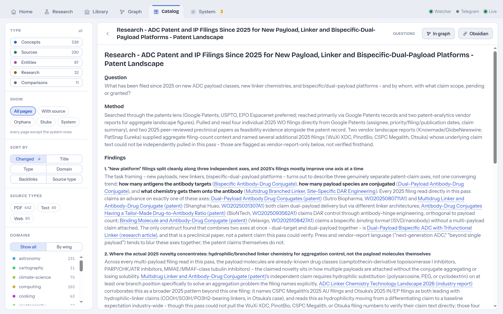

### Library - the vault as a room

*Only with `AGENTS_ENABLED`; see [Research agents](#research-agents).* Domains are shelves and
Fellows are figures. The main room holds ten desks, one per Fellow: a Fellow stands at its own desk
whatever it is doing, its shirt in its shelf's colour, its screen lit only while it works, and the
bubble over its head says what that is. Reading takes it to its shelf, in the main room or in a
wing. Hovering a desk names its shelf; clicking one opens the night shift on that shelf, or on the
night itself for an empty desk, where a new Fellow is spawned.

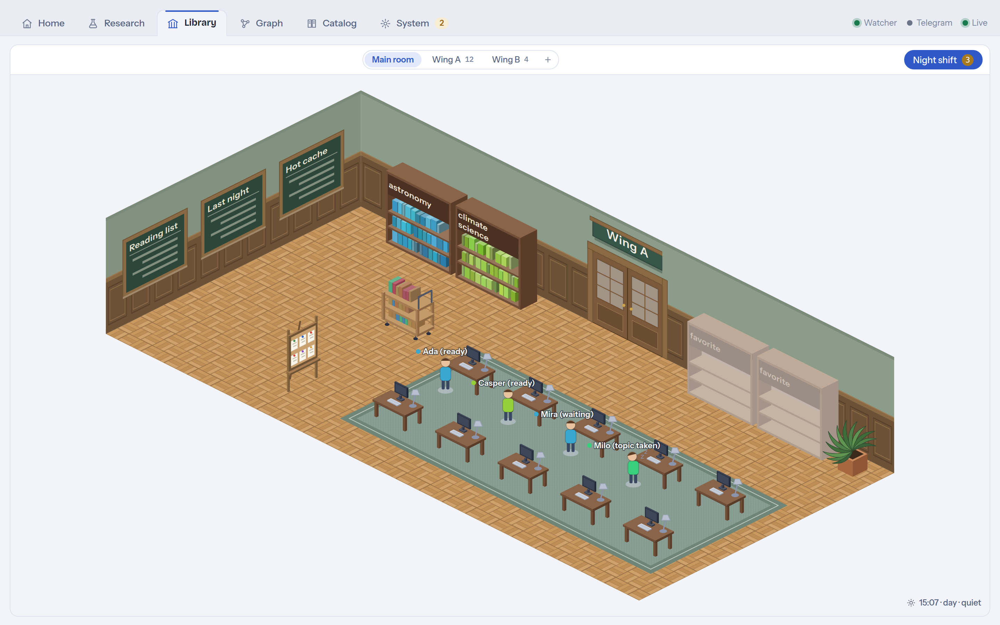

Three boards hang on the short wall - the hot cache, last night's recap, the reading list - and two
stations stand on the floor. The **book cart** is where the maintenance runs work and where the
ingest queue's parcels wait; clicking it opens System. The **pinboard** carries every open question
the vault's pages left behind, one pinned card each: open it and the questions stand by domain,
walked with the keys. **The same question asked on several pages is one card**, not one per page,
with the others listed as *also on* links: a vault writes a gap down wherever it meets it, and a
board that showed each copy would be mostly repetition. *Start research* **reformulates** the
bullet into a topic before handing it to the Research tab - a question written for its own page
rarely stands alone, so the page it came from travels with it into the run as context. *Archive*
strikes it through on its own page, which is the convention the Fellows already honour, so a
closed question leaves their planning too - and vetoes the run a Fellow had planned from it.

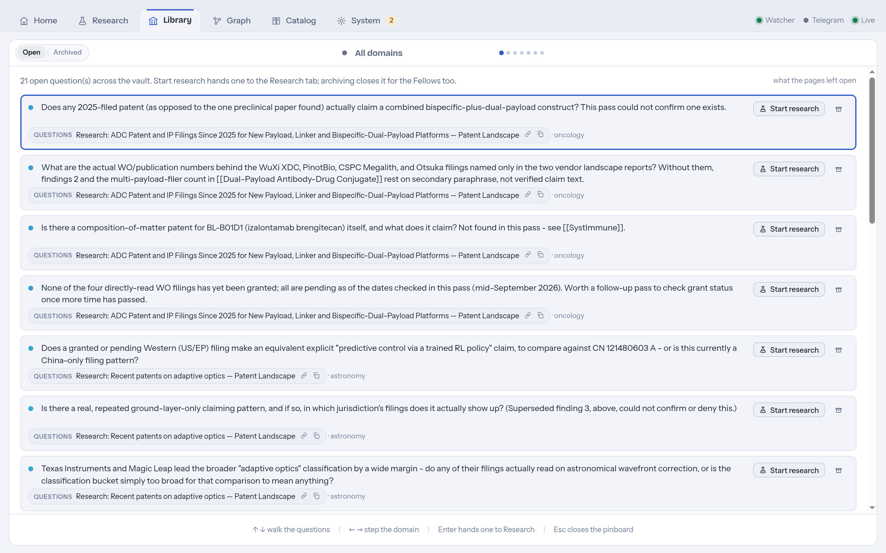

A shelf is one domain, its colour is the domain's, and how full it is is how many pages that domain
holds. The domains stand in wings off the main room, behind glazed double doors.

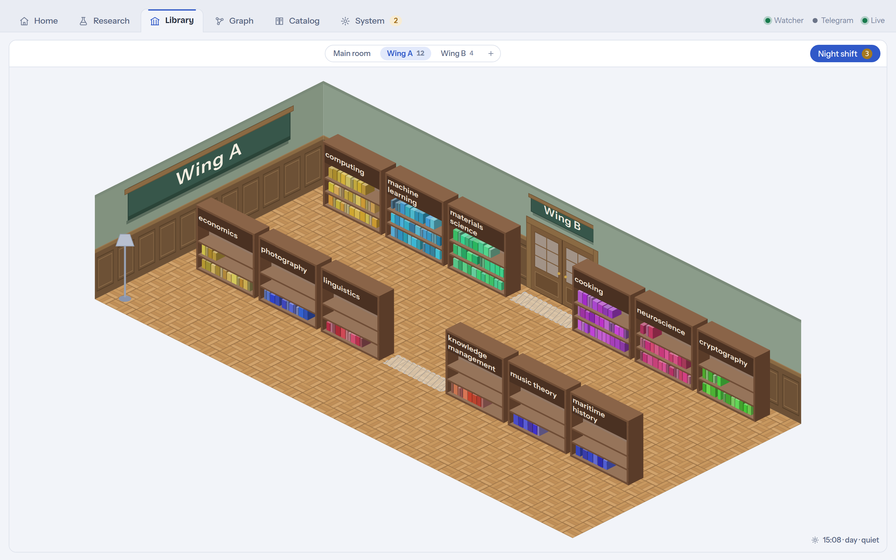

One window manages the Fellows completely: tonight's schedule priced from the runs this vault has
actually made, a dossier per Fellow (notebook, recap slice, run ledger, settings), the decisions
waiting for you, and the spawn form.

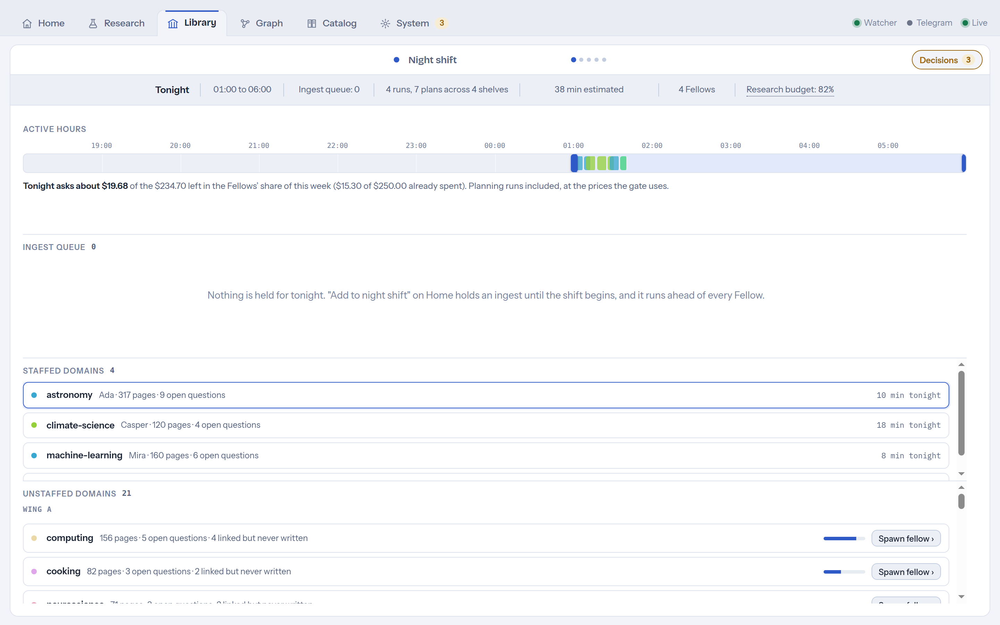

### Graph - the wikilink structure

On a canvas, with the force layout in a web worker so it stays smooth as the vault grows.
**Colour lenses** recolour the same graph by `domain:` (the default), by page type, or by a metric
(authority, recency, orphans, stubs). Recency reads what a page **says** about itself rather than
its file mtime, so a mass pass over the vault does not repaint every node as new, and with one
domain on show it rises to that domain's colour. Page-type chips and a domain list filter what is
shown; **search narrows** rather than highlights. Structural scaffolding and maintenance artifacts
are hidden by default; one toggle brings them back.

**Overlays** read the same picture four ways:

- **Landmarks** draws only the pages one domain is built around - its most-linked pages inside the
  domain - spread over the drawing and named in full, with a numbered **reading order** beside it:
  a walk from the strongest page through the ones linked to what was already read, broken into
  chapters where nothing links on. A click on a landmark, or on its number in the list, opens its
  neighbourhood; a click on a title opens the page. The authority and recency colours span the
  landmarks themselves, and walking the domains with `←` `→` keeps the overlay on and skips the
  domains too small for it.
- **Areas** outline every detected community as a tinted hull captioned by its distinctive tags -
  never by a tag that names a kind of page rather than a subject, such as `person` or `video`.
  `a` and `d` step through the areas one at a time, a click shows one alone, a click on a page
  opens it, and the area under the pointer is outlined and its caption underlined.
- **Spotlight** lights the community under the pointer and names it; a click isolates it, and the
  next click drills into its sub-communities.
- **Bridges** brightens the links that run between communities.

The **lock** holds the picture as it is: a click then opens a page, and `Esc` from the page comes
back to exactly this drawing. Keys: double-click opens a page, `/` searches, `f` fits, `←` `→` step
the domains, `Esc` steps back one layer; the Shortcuts card in the corner lists what the overlay on
screen binds.

The **page view** behind it has rendered markdown, clickable `[[wikilinks]]`, a frontmatter panel
and, beside it, the same three link lists the graph's page panel shows: backlinks, links to, and
pages related by tag. A page from another domain counts as related only when it shares two
subjects, not one. Pages can be **edited and deleted here** - every mutation is one git
commit, serialized behind the same mutex as agent commits, with an optimistic lock (409 if an agent
changed the page since you loaded it). After a delete, a banner counts the backlinks that just went
dangling and offers a cleanup run.


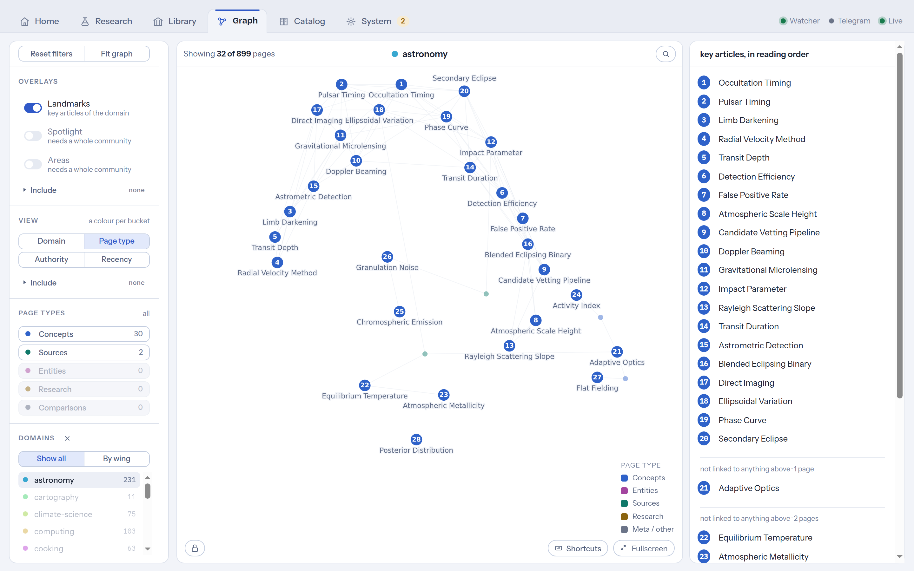

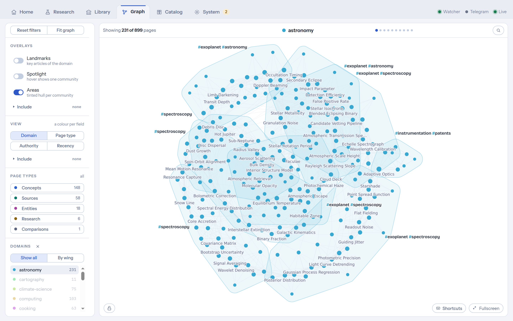

### Catalog - one table over every page

The browse path a graph cannot give you, fed by the same graph query the canvas uses. Filter by
page type, domain, health (with a source, orphans, stubs, system pages) or origin (PDF, web, text);
sort by recency, title, type, domain, backlinks or source type. Each row carries the domain, link
counts, when it changed, and a **source** column that opens the document the page came from - read
from the vault's own `.raw/` manifests rather than from SQLite, because losing operational state
must never lose provenance. *Called Library until September 2026; the name moved to the room.*


### System - the machine room

A map of the machine room rather than a stack of panels. **Overview** says what needs you now:
every maintenance area with its state, and one guided run through what is due. **Maintenance** has
a page per area - lint and links (a structured report and a "fix safe findings" run that automates
only the mechanical categories), the **standing defects** described below and their repairs, the
domains (filing pages, proposing new domains, splitting an oversized one), tags, the hot cache, the
retrieval index, and the pages git does not have yet. **Insight** holds usage and cost (tokens,
spend, the plan, the daily budget as a meter, every priced run), vault stats (growth, loose ends,
pages per domain) and the history of every agent run and vault commit. **Settings** groups the
runtime configuration into intake, runs & budget and the Fellows' research budget, and **Instance**
holds the Anthropic credential, the Telegram bot and the service facts.


### Across the screens

- **Page links** open the in-app viewer first; `obsidian://` is the secondary action, which keeps
  the dashboard usable from a Windows browser that cannot open a WSL vault over `\\wsl$`.
- **The graph updates live**: while an ingest writes pages a debounced SSE event refreshes it, new
  nodes surface at their neighbours' centroid, existing nodes keep their positions.
- **Domains** are the vault's meta-categories, the axis everything filters and colours by. The
  allowed list is the editable vault page `wiki/meta/domains.md` (seeded by
  `scripts/install-domain-registry.sh`); every vault-writing run gets it as a **closed** set - one
  key per page, `unassigned` when nothing fits, never a new key. Only humans create domains: by
  editing the page, or by accepting a candidate the **governance loop** proposes for free from
  themes among the `unassigned` pages. The backfill files existing pages retroactively. A domain
  that outgrows being a shelf can be **split into peers**: a free, deterministic proposal of the
  shelves it falls into, a decision per shelf, and one commit that re-files exactly the approved
  pages and that one revert undoes.
- **Every write is checked** afterwards, deterministically and read-only: missing frontmatter, dead
  links, orphans, stale counters, an overgrown hot cache, and a dozen more rules. A finding never
  rewrites anything on its own. They stand as a **defect list** under System → Standing defects,
  one row per defect with how often it has been seen and how long it has stood, rather than one
  advisory line per run buried in a job log - a single dead link was once reported 109 times. Each
  rule says what can be done about it: a deterministic repair shown as a diff before it writes, a
  **bound agent run** that may touch exactly the pages of the chosen findings and is reverted in
  one click, or an **accept** with a reason for a defect that may stay. A row disappears when a
  check no longer finds it.
- **Hybrid retrieval.** The read-only query path can use the vault's opt-in `wiki-retrieve` skill
  (contextual chunk prefixes + BM25, after [Anthropic's contextual-retrieval
  method](https://www.anthropic.com/news/contextual-retrieval)). Build the index once from
  System → Retrieval index; it lives under `.vault-meta/`, out of vault git, rebuilt after
  ingests, and needs no agent, credential or network. The service runs the retrieval and hands the
  agent five distinct pages, best first. Local reranking with ollama is built but off: over a
  35-question labeled set it lost to BM25 alone (top-5 94% against 97%), so ollama is not a
  requirement.

---

## Research agents

*Optional, off by default.*

A **Fellow** is a standing research agent. You give it a subject, one to three standing tasks and a
budget; it works at night on its own and leaves a record you read in the morning. It keeps a
notebook page in the vault, plans from what the vault itself says is unanswered, and comes back to
the same subject night after night. The room seats ten; the eleventh spawn is refused until one
retires.

```bash
echo 'AGENTS_ENABLED=1' >> ~/.config/vault-service/env   # then restart the service
```

With the flag unset none of it exists: no schedule, no routes, no Library tab, and no request to
any of it.

- **A night.** Once the window opens (01:00 to 06:00 by default) a planning run reads what the
  vault holds - open questions on its own pages, unwritten link targets, stub pages, what your
  recent ingests brought in - and proposes concrete runs against one standing task, each with its
  reasoning, its origin, a score for how close to the task it stays, and an estimated cost. Then the
  runs: read the sources, write or extend pages, update the notebook.
- **A task has an art.** `watch` looks for what is new, `explore` pursues an open question until
  the vault has it covered, `deepen` builds out pages the library points at more than they pay off.
  Three per Fellow at most; a fourth subject is a second Fellow.
- **You decide how much say you want.** `manual`: nothing runs without your click. `veto` (the
  default): a proposal you did not decide on runs - deciding is how you stop something. `auto`: you
  are not asked. The morning **recap** is where the decisions are, per day and per Fellow,
  answerable in the dashboard or by Telegram reply.
- **The budget is a share of your subscription, not a pile of money.** Runs are priced in plan
  utilization measured against the runs this vault has actually made, and a Fellow stops at
  whichever binds first: its runs-per-day quota, the daily budget, or the research share of the
  five-hour and weekly windows, which keep reserves for your own work.
- **Where the work lands.** In the vault as ordinary pages, written by ordinary runs behind the same
  commit mutex as an ingest, so `git revert` undoes a night like anything else; in one notebook page
  per Fellow under `wiki/meta/agents/`; and in the Library screen.

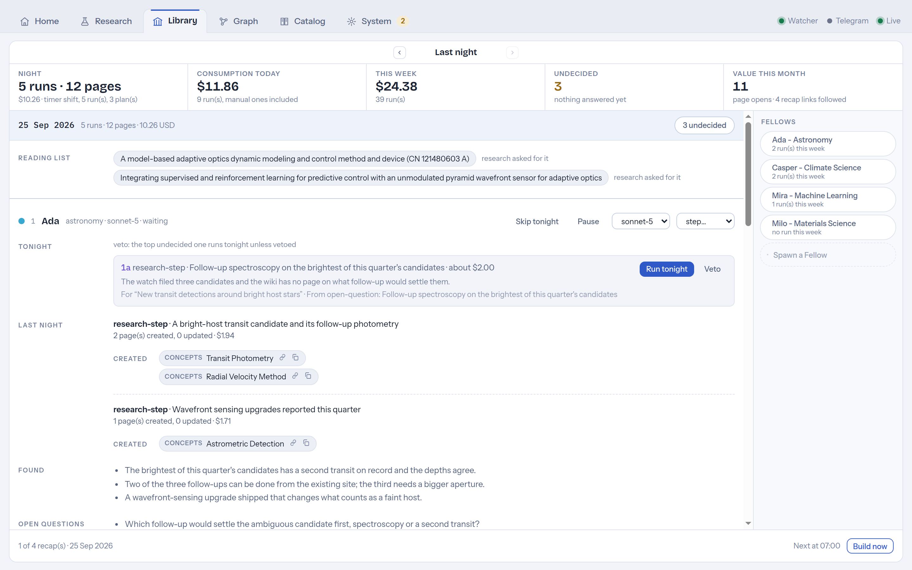

The same night reads two ways: the wall board keeps the whole of it, a dossier keeps everything
about one Fellow, and Home shows the recap where a morning actually starts.

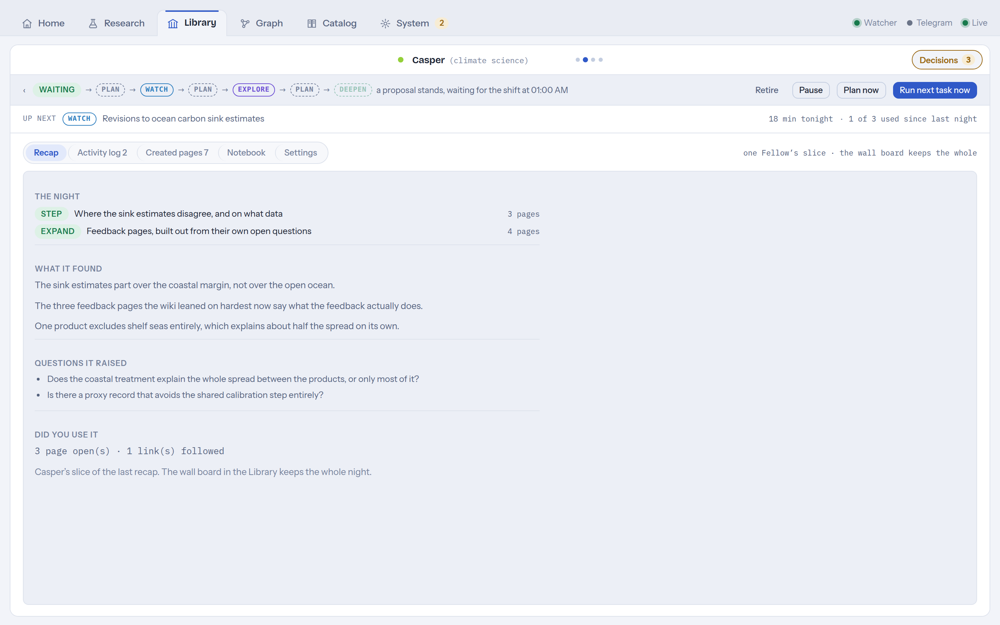

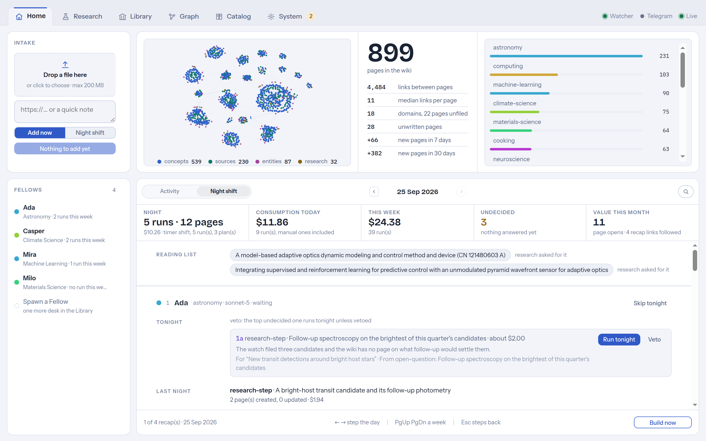

Details: [`docs/agents/SPEC.md`](docs/agents/SPEC.md), summarised in SPEC.md section 12.10.

---

## Source integrity

Five mechanisms that harden how material is acquired and read, plus one that limits what a research
run may do to an existing page. Unlike the research agents these are **not** behind a flag: each
corrects the pipeline rather than adding something beside it, and a correctness fix behind a flag
ships the weaker path as the default.

- **A URL that serves a PDF is read as one.** Detection is by what comes back, not by the address.
- **Everything a converter produces is fenced as data.** Extracted text reaches the agent inside an
  explicit boundary saying it is material to read, never instructions to follow; text inside it
  that addresses an assistant is reported to you rather than passed on. This is the
  prompt-injection boundary, at the one place every ingest crosses.
- **A blocked or abstract-thin page is rescued from a legal open copy.** When a URL lands on a
  paywall and names a DOI, the service asks three open scholarly indexes for a legal open-access
  copy, fetches it if there is one, and records on the page which copy the text came from. This
  makes outbound requests of its own; see the security model.
- **Quotes are checked against the text the run actually read**, verbatim; a quote that cannot be
  found is flagged, not deleted.
- **A deepening run is confined while it runs** (the *expand lock*): only the pages it was given,
  only insertions, enforced at tool time rather than at the commit.

One part rides along with the research agents and needs the flag: the nightly **reading-list
sweep**, which re-checks publications nobody could read for an open copy and marks them for
one-click ingest.

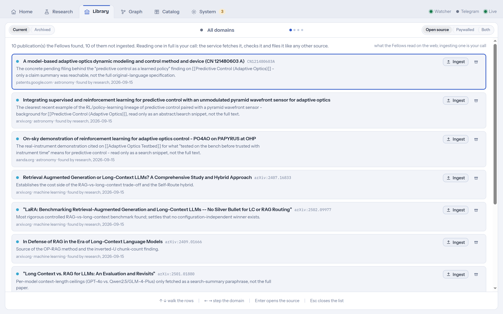

Details: [`docs/sources/SPEC.md`](docs/sources/SPEC.md), summarised in SPEC.md section 12.11.

---

## Telegram bot

*Optional.* Send the bot a PDF, a photo, a URL or a note and it lands in the regular queue; when the
ingest finishes the bot reports the created page titles. `/status` answers with queue, job and
budget state, `/jobs` lists recent jobs, `/research <topic>` starts a web research run - the one
bot action that reaches the web.

The transport is **outbound long polling**: the service calls `api.telegram.org`, nothing calls the
service. No port is opened, the localhost bind is untouched, and it works from anywhere your phone
has internet.

**Setup.** Create a bot with [@BotFather](https://t.me/BotFather) (`/newbot`) for the token, get
your numeric id from a bot like `@userinfobot` (usernames are mutable and spoofable), then either
use System → Instance → "Set up Telegram bot…" or edit `~/.config/vault-service/env`:

```bash
TELEGRAM_BOT_TOKEN=123456789:AAF...
TELEGRAM_ALLOWED_USER_IDS=111111111        # comma-separated for several people
```

Restart afterwards (the dashboard path does it for you under systemd), then send `/status`.

- **Allowlist, fail-closed.** A token without `TELEGRAM_ALLOWED_USER_IDS` refuses startup. Messages
  from ids outside the list get **no answer at all**: a reply would confirm the bot exists, and
  every accepted message can start a paid run. The journal records the first attempt per sender id
  (id and username, never content).
- **Files up to 20 MB** (Telegram's bot download limit); albums become one batch.
- **Notifications carry titles only.** Vault content does not transit Telegram's cloud.
- **Exactly one poller per token.** A second instance polling the same token makes the bot log the
  conflict and stop; the service keeps running.
- **Disabling:** System → Instance → "Disable" removes both variables. The token is never
  displayed after saving; revoke it in BotFather if it may have leaked.

---

## Configuration

Two layers, one precedence rule: the environment (or `~/.config/vault-service/env`) is the
start-time **baseline**, the settings table (System → Settings) holds runtime **overrides**, and
the effective value is `override ?? baseline`. Overrides live in SQLite and survive a restart.

| Variable | Default | Notes |
|---|---|---|
| `VAULT_ROOT` | - | **required**; validated at startup |
| `HOST` | `127.0.0.1` | see the bind rule in the security model |
| `PORT` | `8420` | |
| `WATCH_FOLDER` | `/mnt/c/inbox` | targets a Windows mount; on plain Linux point it elsewhere. Runtime-settable, restart required |
| `MAX_UPLOAD_BYTES` | 200 MB | runtime-settable, restart required |
| `HTTP_AUTH_MODE` | `local-single-user` | `token` enables bearer auth |
| `HTTP_AUTH_TOKEN` | - | required for a non-loopback bind |
| `WATCH_POLLING` | auto | forced on for `/mnt/*` (no inotify on Windows mounts) |
| `OBSIDIAN_VAULT_NAME` | vault dir name | for `obsidian://` deep links |
| `TELEGRAM_BOT_TOKEN` | - | enables the bot; a secret, handled like the credential |
| `TELEGRAM_ALLOWED_USER_IDS` | - | comma-separated numeric ids; **required** once the token is set |
| `DB_PATH` | `~/.local/share/vault-service/jobs.db` | kept **outside** the vault |
| `AGENTS_ENABLED` | off | `1` turns on the research agents; off changes nothing, network included |
| `DEMO_MODE` | off | `1` serves the vault strictly read-only for a public instance; with `AGENTS_ENABLED` the Fellows are shown too, never run |
| `PREPROCESS_SANDBOX` | on | `off` runs the converters without their bubblewrap jail. Only for a machine that cannot install bubblewrap |
| `CORE_API_KEY` | - | optional; unlocks the third open-access resolver (CORE). A secret, handled like the credential |
| `OA_CONTACT_EMAIL` | - | optional; sent to OpenAlex as its `mailto` parameter for the polite pool, and nowhere else |

Runtime-settable under System → Settings (Intake, Runs & budget, Research budget): watch folder,
concurrency, upload limit, the research shares and reserves, the plan name, the five-hour release,
the duplicate judge, git auto-commit, open-access rescue, DOI and URL dedupe, the daily budget.
The bind address is **not** settable through the UI, by design; the credential only through the
guarded endpoint that writes the env file, and it is never displayed or stored elsewhere.

**Daily budget (optional).** The unit follows the auth mode: a **job count per day** on a
subscription (no per-run charge; runs compete with your interactive usage), a **USD amount per
day** on an API key. When the budget is reached the queue stops claiming new work and resumes at the
next local midnight. In subscription mode every `cost_usd` in the UI is labelled "estimate": an
API-price equivalent, not money charged.

**Hosting a read-only demo.** `DEMO_MODE=1` needs no credential: the queue, the watcher, the
Telegram bot and every maintenance writer stay off, and every request that is not a read is refused
before it reaches a route. With `AGENTS_ENABLED=1` the Library, the recaps and the pinboard are
shown from the database, and nothing ever runs. `scripts/demo-vault.mjs` seeds a synthetic vault
and a matching database for exactly this (the screenshots above come from it); its dates are
relative to the build, so rebuild it on a schedule. Put a reverse proxy in front: the service keeps
binding `127.0.0.1`, and the proxy is where a `robots.txt` belongs, because the app answers every
unknown path with its shell. The vault may be mounted read-only for the service.

---

## Security model

Six constraints are essential. `CLAUDE.md` documents them in full; `SECURITY.md` has the threat
model, including what a malicious *document* can and cannot make the ingest agent do, and the
reporting channel.

1. **Vault integrity.** Everything the service writes is one immediate git commit behind a shared
   mutex, so it is versioned, revertable and can never interleave with an agent's own commit. A
   page write additionally takes the vault's own per-file lock (`scripts/wiki-lock.sh`, mandatory
   in claude-obsidian from v1.7). Four paths write and only these: an agent run; a page you edit,
   delete or - on the pinboard - strike through in the dashboard; the vault's own deterministic
   retrieval-index scripts, whose artifacts stay outside git history; and the removal of a
   never-committed staging directory when a job turns out to be a duplicate. SQLite holds
   operational state only - losing it must never damage the vault.
2. **Localhost guard.** The server binds `127.0.0.1`. If the bind is not loopback and no auth mode
   with a token is active, it **refuses to start**. State-changing requests carrying a foreign
   browser `Origin` are rejected.
3. **Credentials** live only in the service environment - never in the repo, logs, frontend or
   database. Both credential variables set at once is a startup error.
4. **Agent confinement is enforced by the OS sandbox**, not by application-level callbacks. Runs
   execute under bubblewrap with writes confined to `VAULT_ROOT`, and an **ingest** run has no web
   egress at all. Tool policy additionally runs through a `PreToolUse` hook; `canUseTool` was
   measured to be invoked *zero* times by this SDK and is not the enforcement point. What may reach
   the web: the autoresearch flow and a research agent's own runs. What never does: an ingest, and a
   Fellow's planning run.
5. **Plugin internals stay read-only.** The vault is a clone of claude-obsidian, so its own
   machinery sits inside the sandbox's writable area. A `PreToolUse` write guard confines agent
   writes to the knowledge areas and refuses edits to plugin files.
6. **The converters are jailed one stage earlier.** `pdftotext`, `pdfinfo`, `ocrmypdf`, `pandoc`,
   the Office extractors, `exiftool` and `defuddle` each run under bubblewrap with no network, no
   `$HOME`, a read-only system, the one input file and one writable output directory - a hostile
   document reaches a parser *before* any agent sees it. `yt-dlp` is the documented exception,
   because fetching is its job.

The sandbox is configured with `failIfUnavailable: true`: if bubblewrap cannot start, a run **fails
loudly** instead of silently running unconfined. A stuck run cannot outlive its timeout either: the
runner owns the CLI spawn, puts it in its own process group and escalates a timeout to a group
`SIGKILL`. Both guarantees rest on SDK behaviour unit tests cannot observe, so each has a live probe
to re-run after any change to the permission or spawn wiring, or an SDK upgrade:

```bash
VAULT_ROOT=~/vault npm run permprobe --workspace server       # expects both canaries blocked
VAULT_ROOT=/tmp/throwaway-vault npm run killprobe --workspace server   # write-enabled: a THROWAWAY vault
npm run preprocprobe                                          # the converter jail; read-only
```

**Outbound requests the SERVICE makes**, as opposed to an agent: the Telegram bot, if you configure
one; and open-access recovery, which asks `api.openalex.org`, `api.core.ac.uk` and `www.ebi.ac.uk`
whether a legal copy of a paywalled paper exists, sending the DOI of the document you are ingesting.
That one is **on by default**; turn it off under System → Intake.

---

## Docker

The image exists so the service can move to an always-on Linux host later (SPEC.md §12.2); under WSL
the systemd unit is the day-to-day path.

```bash
docker build -t librisvault .
docker run --rm \
  -v ~/vault:/vault -v librisvault-data:/data -v ~/inbox:/inbox \
  -e CLAUDE_CODE_OAUTH_TOKEN=... \
  --security-opt seccomp=unconfined \
  -p 127.0.0.1:8420:8420 \
  -e HOST=0.0.0.0 -e HTTP_AUTH_MODE=token -e HTTP_AUTH_TOKEN=<secret> \
  librisvault
```

Verified on Docker Desktop 4.52 / Engine 29.0.1 (linux/amd64). Publishing the port requires a token:
the localhost guard is not relaxed inside a container. Pass the credential and the Telegram
variables as environment variables; the settings endpoints refuse with `409` when these come from
the process environment. In token mode the browser UI is not reachable, only the API (a login screen
is future work, SPEC.md §12.1). bubblewrap needs unprivileged user namespaces: depending on the host,
`--security-opt seccomp=unconfined` or `--cap-add SYS_ADMIN`. A bind-mounted vault owned by you needs
`--user "$(id -u):$(id -g)"` to be writable, because the container runs as uid 10001.

---

## Development

```bash
npm test                 # server + web unit tests (vitest); agent runs are mocked
npm run typecheck        # server + web
npm run lint             # server + web (eslint)
```

All three must pass **and exit 0** before a milestone is done: `tsconfig.build.json` excludes the
tests and vitest does not typecheck, so a green suite is not a green repo.

```
server/   Fastify backend, TypeScript ESM
  src/api/        routes under /api/v1, auth middleware
  src/pipeline/   watcher, queue, preprocessing plugins, agent runner, permissions, Fellows
  src/telegram/   bot api client, long-poll loop, update router, message formatting
  src/db/         better-sqlite3 schema + migrations
web/      React + Vite frontend (responsive, PWA-ready)
  src/tabs/       one file per screen: Home, Chat (= Research), Vault (= Graph), Catalog,
                  LibraryScreen, System, plus Maintenance and Recap
  src/components/ shared vocabulary: cards, tables, status, charts, the graph canvas, the room
scripts/  setup helpers, systemd unit template, demo vault + screenshot tooling
docs/     the two detail specs, the API list, the screenshot recipe, task lists and findings
```

TypeScript strict, ESM, conventional commits. Pipeline logic (queue transitions, dedupe,
preprocessing, guards) gets unit tests; agent runs are mocked; Fellow logic is tested the same way.
New source types are preprocessing plugins, never special cases in the pipeline core.

This repository is public and the vault it drives is private. `scripts/vault-name-scan.mjs` looks
for the vault's page titles in file content (`--diff <base>` over what a merge would add, `--file`
over a PR body), which the `commit-msg` hook, installed by `scripts/install-git-hooks.sh`, cannot
see. Screenshots come from a synthetic vault: [docs/screenshots.md](docs/screenshots.md). The full
endpoint list is in [docs/API.md](docs/API.md).

---

## Troubleshooting

- **Frontend changes don't show up, or the dashboard comes up blank.** Static file routes are
  registered at startup, so a running service keeps serving the old asset names while the new
  hashed files 404. Restart the service. `npm run build` next to a running service is enough to
  blank it - every service serving that `web/dist`, the demo instance included.
- **Port 8420 already in use.** Usually an orphaned process from a killed `tsx`/`npm` wrapper:
  `ss -ltnp | grep 8420`, then kill the PID. The systemd unit avoids this by running the built JS.
- **Agent runs fail with a sandbox error.** `bubblewrap` or `socat` is missing, or user namespaces
  are unavailable (common in containers). Install the packages rather than disabling the sandbox.
- **Runs fail with "zero tokens" / "Not logged in".** The credential did not reach the subprocess.
  Check `~/.config/vault-service/env` and that only one credential variable is set.
- **Everything answers 503 with a "Set up now" banner.** That is setup mode. Add the credential
  under System → Instance; the service restarts itself and picks up queued work.
- **The watch folder never fires.** Windows mounts deliver no inotify events; the watcher switches
  to polling automatically. Force it with `WATCH_POLLING=true`.
- **A page the agent wrote is missing from the commit.** The commit pathspec comes from the agent's
  `Write`/`Edit` calls; a page created with `Bash` is invisible to that, and is swept in only while
  the run can prove it was the sole vault writer. Commit it by hand; nothing is lost.
- **The Telegram bot went silent.** `getUpdates conflict (409)` in the log means a second process
  polled the same token; `401 Unauthorized` means the token is wrong or revoked. Both stop only the
  bot. Senders outside the allowlist never get a reply - that silence is the guard working.
- **Obsidian cannot open the vault over `\\wsl$`.** It can't (`EISDIR … watch`). Run Obsidian inside
  WSL via WSLg; the Graph and Catalog screens exist so everyday reading does not need Obsidian.

---

## Status & license

A personal project (v0.1) built milestone by milestone with Claude Code. M0 to M5 built the base
product; the research agents and the source-integrity work were built on top afterwards, as their
own series (A0 to A7) with their own specifications. It is not versioned and there are no
releases: work lands as one merge per body of work, each tagged by what it was and the day it
landed, and [CHANGELOG.md](CHANGELOG.md) says what moved between them. The engineering journals in `docs/tasks/` are
left in as they are - findings, dead ends, measurements and all - and record what is still open as
plainly as what is done. Issues and PRs are welcome, with the caveat that `SPEC.md` and the hard
rules in `CLAUDE.md` define what this is and is not.

Licensed under the [PolyForm Noncommercial License 1.0.0](LICENSE) © Benjamin Steinborn. Any
noncommercial purpose is permitted: personal use, study, hobby projects, and use by charities,
schools, public research organizations and government institutions. Commercial use needs a separate
license, so open an issue if you want one.

The vault this service drives is a separate project,
[claude-obsidian](https://github.com/AgriciDaniel/claude-obsidian) by AgriciDaniel, under the MIT
license. No part of it lives in this repository: the service reads and drives a vault it never
vendors, and its license is unaffected by the one above.
