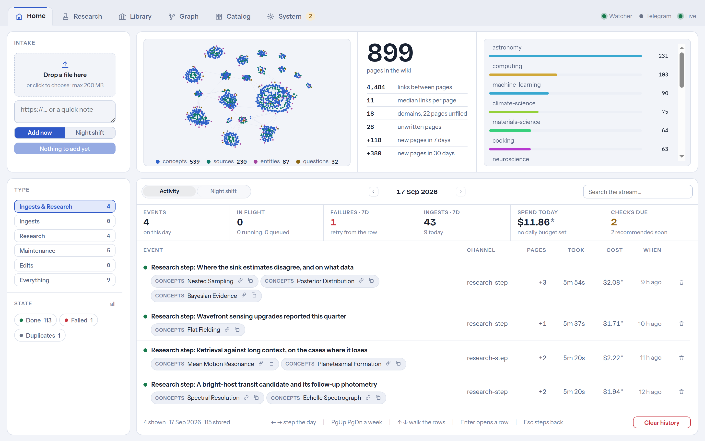
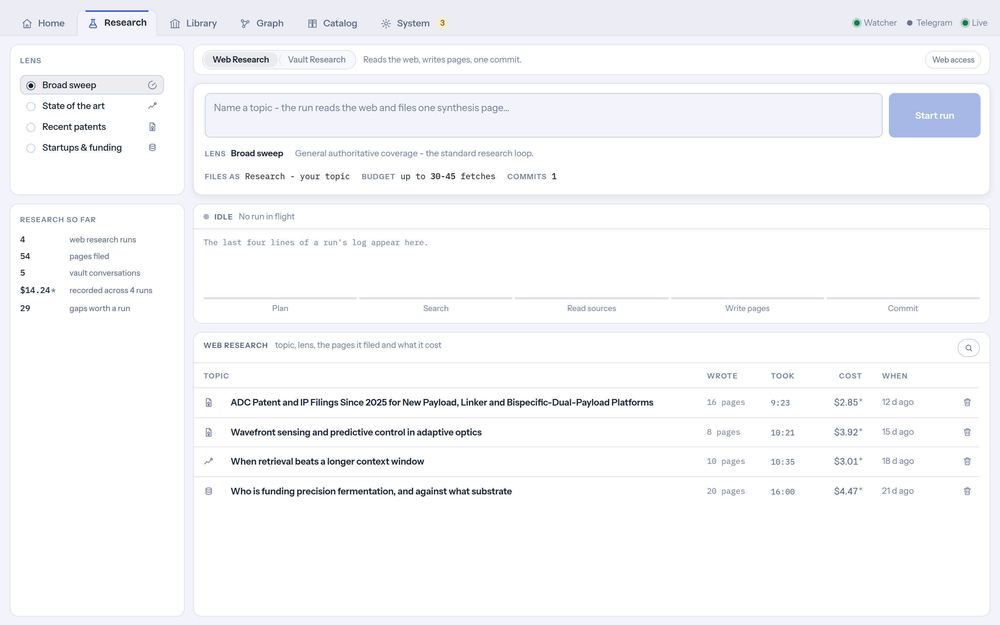
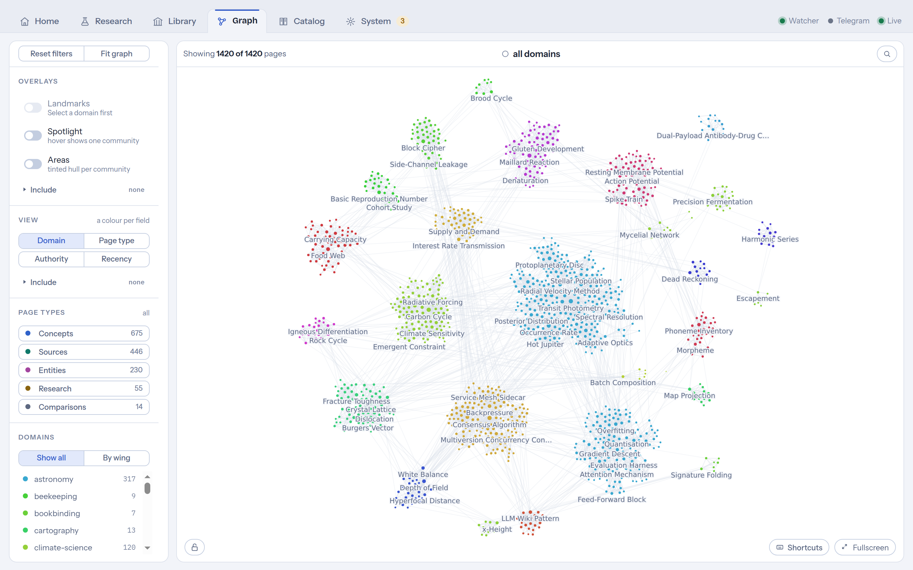
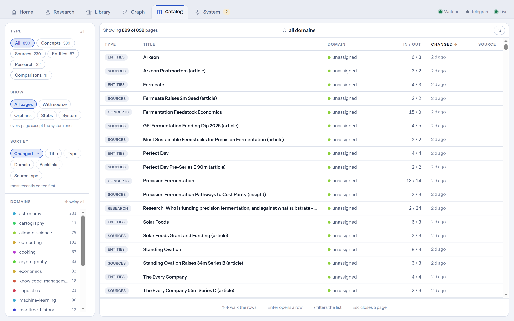

<p align="center">
  
</p>

# LibrisVault

[](LICENSE)

Drop a PDF into a folder - a few minutes later it is a set of linked, cited wiki pages in your
personal knowledge vault.

LibrisVault is a local ingestion service and web dashboard on top of a
[claude-obsidian](https://github.com/AgriciDaniel/claude-obsidian) vault (v1.9.2, Generic mode).
It watches a folder, accepts drag-and-drop uploads and (optionally) files sent to a Telegram bot
from your phone, preprocesses the material (PDF, Office, web, images, text), and runs headless
Claude Agent SDK sessions that execute the vault's `ingest` skill fully automatically. A React
dashboard exposes intake and status, web and vault research with citations, an interactive graph
and page viewer, a browsable library of every page, and the machine room behind it all.



<sub>Every screenshot on this page comes from a **synthetic** vault - textbook subject matter,
generic document titles, no real notes, people or sources. Regenerate it and re-shoot the set
with `scripts/demo-vault.mjs` + `scripts/shoot-screens.mjs` (see
[Screenshots](#screenshots)).</sub>

Everything runs on your machine: the service binds `127.0.0.1` by default, the vault stays a plain
git repository on disk, and the only thing that leaves the box is the agent's traffic to Anthropic -
plus, if you enable the Telegram bot, its outbound polling of `api.telegram.org`.

> **`SPEC.md` is the authoritative specification.** When code and spec disagree, the spec
> wins. The UI, code, and everything else are English. `CLAUDE.md` holds the hard rules that
> constrain any change. Per-milestone task lists and engineering findings live in `docs/tasks/`.

---

## Quick start (TL;DR)

**One command** (Linux, or Windows + WSL2 with Ubuntu):

```bash
git clone https://github.com/steinborndev/LibrisVault.git && cd LibrisVault
bash scripts/setup-all.sh
```

That installs everything (Node via nvm, sandbox + preprocessing toolchain, the vault,
the systemd service), starts the dashboard at <http://localhost:8420>, and leaves exactly
one step for the browser: the dashboard opens in **setup mode** and walks you through
connecting your Anthropic account (Claude subscription or API key) under
System → Integrations.

**Windows without WSL yet:** download the repo as a ZIP (GitHub: Code → Download ZIP - no
git needed on Windows), unpack it, and run `scripts\install.ps1` in PowerShell - it installs
WSL2 + Ubuntu, runs the setup above inside it, and puts a LibrisVault shortcut on your desktop.

**Manually instead:**

```bash
# 1. This repo - the service itself. It lives NEXT TO the vault, never inside it,
#    and finds the vault via VAULT_ROOT (step 4).
git clone https://github.com/steinborndev/LibrisVault.git && cd LibrisVault

# 2. The vault this service writes into (a separate repo, OUTSIDE this one).
#    Cloned from our fork, pinned to the tested version. Push is disabled:
#    the vault fills with private content, and origin is a public repo.
git clone https://github.com/steinborndev/claude-obsidian ~/vault
(cd ~/vault && git checkout -B vault-main v1.9.2 \
  && git remote set-url --push origin PUSH_DISABLED_vault_is_private \
  && bash bin/setup-vault.sh)

# 3. Sandbox + preprocessing toolchain
sudo apt-get install -y bubblewrap socat
./scripts/install-preprocessing-tools.sh

# 4. Build + run (needs Node >= 20 on PATH - see Requirements for the nvm one-liner),
#    then open http://127.0.0.1:8420 and add the credential in the UI
npm ci && npm run build
VAULT_ROOT=~/vault npm start
```

Each step is explained below; for an always-on setup see
[Autostart with systemd](#autostart-with-systemd-survives-a-wsl-restart).

---

## Requirements

What the **machine** needs - the LibrisVault repo itself is not listed because acquiring it is
step 1 of the quick start, not a prerequisite. `setup-all.sh` installs everything in this table
except the OS; the manual path below installs each row explicitly. `git` and `curl` are assumed
(both ship with the stock Ubuntu WSL image).

| | |
|---|---|
| OS | Debian/Ubuntu-family Linux (the toolchain installs via `apt`), or Windows + WSL2 (Ubuntu 24.04 is what this was built and e2e-tested on) |
| Node | ≥ 20 LTS - `setup-all.sh` installs it via [nvm](https://github.com/nvm-sh/nvm); manual: `curl -fsSL https://raw.githubusercontent.com/nvm-sh/nvm/v0.40.1/install.sh \| bash`, then `nvm install 20`. Already-loaded shells: `. ~/.nvm/nvm.sh` |
| Vault | a claude-obsidian clone (**built and tested against v1.9.2**, Generic mode), by default at `~/vault`. Cloned from [our fork](https://github.com/steinborndev/claude-obsidian) and pinned to the tested tag, so upstream changes can never break a fresh install |
| Credential | a Claude subscription token **or** an Anthropic API key (exactly one) - entered in the dashboard on first run, not needed to start |
| Claude Code CLI | only for the subscription path, to run `claude setup-token` once - install with `npm install -g @anthropic-ai/claude-code` |
| Sandbox | `bubblewrap` + `socat` - **required**, agent runs fail without them |
| Preprocessing | poppler-utils, ocrmypdf, tesseract, pandoc, exiftool, defuddle, yt-dlp + deno (YouTube URLs: metadata + subtitles - yt-dlp needs a JS runtime to clear YouTube's bot check) |

### 1. The vault

The vault lives **outside this repo** and its path is a configuration value - nothing hardcodes it.

```bash
git clone https://github.com/steinborndev/claude-obsidian ~/vault
cd ~/vault && git checkout -B vault-main v1.9.2
git remote set-url --push origin PUSH_DISABLED_vault_is_private  # vault content is private; origin is public
bash bin/setup-vault.sh
```

The service checks at startup that `VAULT_ROOT` contains `wiki/` and `skills/`, so pointing it at
the wrong directory fails immediately instead of at the first agent run.

### 2. Toolchain

```bash
sudo apt-get install -y bubblewrap socat        # sandbox - not optional, see "Security model"
./scripts/install-preprocessing-tools.sh        # poppler, ocrmypdf, tesseract, pandoc, …
```

### 3. Credential

**The easy path: none needed up front.** Without a credential the service starts in **setup
mode** - the dashboard shows a "Set up now" banner and collects the key under System →
Integrations (choose Claude subscription or Anthropic API key), writes it into the service env
file, and restarts itself (under systemd). Everything below is the manual equivalent.

Exactly one credential may be configured - if both are set the service refuses to start, because
`ANTHROPIC_API_KEY` silently overrides the OAuth token and you would not know which one was billed.

```bash
npm install -g @anthropic-ai/claude-code        # once, for the setup-token command below
mkdir -p ~/.config/vault-service
claude setup-token                              # subscription path (recommended)
printf 'CLAUDE_CODE_OAUTH_TOKEN=%s\n' "<token>" > ~/.config/vault-service/env
chmod 600 ~/.config/vault-service/env
```

The credential is read from that file (or the process environment) and is never written to the
repo, the database, the logs, or the API.

### 4. Install and build

Needs Node ≥ 20 on the PATH - see the Requirements row if you don't have it yet
(`setup-all.sh` installs it via nvm automatically).

```bash
. ~/.nvm/nvm.sh          # load nvm's node in this shell (skip if node ≥ 20 is already there)
npm ci
npm run build            # web/dist (SPA) + server/dist (runnable JS)
```

---

## Running it

```bash
VAULT_ROOT=~/vault npm start          # tsx, from source - the everyday dev command
```

Then open <http://127.0.0.1:8420>. `VAULT_ROOT` is deliberately **not** in the credential file;
pass it explicitly.

**With hot reload** (two terminals):

```bash
npm run dev:web                       # Vite dev server, proxies /api
VAULT_ROOT=~/vault npm run dev:server
```

**Production-style** (the built JS, one process - this is what systemd runs):

```bash
npm run build && VAULT_ROOT=~/vault npm run start:prod
```

### Autostart with systemd (survives a WSL restart)

```bash
./scripts/install-systemd.sh ~/vault    # writes + enables the user unit
loginctl enable-linger "$USER"          # so it runs without an active login
systemctl --user start vault-service
```

Check it, and watch the logs:

```bash
systemctl --user status vault-service
curl -s http://127.0.0.1:8420/api/v1/health
journalctl --user -u vault-service -f
```

The unit runs the **built JS as a single `node` process**, not `tsx` or `npm`, so systemd's main
PID is the server itself. A wrapper would leave an orphaned node child holding port 8420 after a
stop. `KillMode=control-group` additionally reaps any in-flight agent run's descendants with the
service. After changing code, `npm run build` and `systemctl --user restart vault-service`.

**Verifying the restart survives a reboot:** in Windows run `wsl --shutdown`, reopen WSL, then
`curl http://127.0.0.1:8420/api/v1/health` - it must answer without any manual start. On restart,
`queued` jobs resume automatically; jobs that were mid-flight when the service stopped are marked
`failed` with an "interrupted by a service restart" reason and are one-click retryable. They are
deliberately *not* replayed automatically: an interrupted ingest may have partially written the
vault, and silently replaying a mid-commit write risks vault integrity.

---

## The dashboard

**Five screens**, as tabs in the header row, all live over SSE. The order follows the day: what
arrived, what you go and find out, the two ways of browsing what is there, then the machine room.

- **Home** - intake and everything in flight. The left rail is the control column: the dropzone
  (files, URLs, a pasted note) on top, then the filters that narrow the stream below it - by kind
  of event, by age, by state, by channel. The workspace answers two questions with two
  treatments: **the stock** on top (how many pages the wiki holds, how many links, how many
  domains, how many pages are linked but never written) with the wikilink graph beside it as a
  picture and the domain split as bars; **the flow** underneath, as a strip of operational
  figures (in flight, failures, ingests, spend today, checks due) over the activity stream they
  belong to. One stream, not one per channel: an ingest, a research run, a maintenance run and a
  vault edit are all rows in the same table, each showing the pages it produced, what it took and
  what it cost. Click a row and it opens in place with the full record - log, commit, pages, and
  the retry or revert action if it has one. A finished ingest can be **reverted** from its row:
  every ingest is exactly one vault commit, so undoing it is one click, and the undo is itself a
  commit, so it stays versioned and reversible. It refuses rather than guessing if the vault has
  uncommitted changes or the revert would conflict.

- **Research** - the screen for going and finding something out, in the two ways that means:

  | | reads | writes | cost |
  |---|---|---|---|
  | **Web research** | the web | files pages, one commit | fetches |
  | **Vault research** | only what the vault already holds | nothing | tokens only |

  Both appear as ledgers of the same shape, so a question and the record of what came back are
  one object wherever you meet them. A **lens** shapes a web run - a closed set of four profiles
  (broad sweep, state of the art, recent patents, startups & funding) that decides how it
  searches and what it files - and the composer shows the run's plan before it starts: the page
  it will file under, the fetch budget, and the step rail it will walk. Answers **stream in as
  they are written** and then settle into the finished message, citing vault pages as clickable
  chips that both deep-link into Obsidian and expand an inline preview. Conversations are named,
  resumable, and savable into the vault as a page. Underneath the ledgers, the vault's own
  **knowledge gaps** sit as a band of offers: the pages other pages link to that nobody has
  written yet, each one a research run you can start with a click.

  

- **Graph** - the wikilink structure on a canvas, with the force layout in a web worker so it
  stays smooth as the vault grows (deliberately, since the WSLg Obsidian graph does not). The
  view bar carries the **colour lenses** - recolour the same graph to answer different questions:
  by `domain:` (the default, one colour per field of knowledge), by page type, or by a metric
  (authority, recency, orphans, stubs). **Overlays** add auto-detected community areas, brightened
  bridges between communities, and a spotlight that isolates one community on hover. Page-type
  pills and a domain list filter what is shown; the domain list doubles as the colour legend and
  scales to any number of domains. **Search narrows the graph** rather than just highlighting:
  a term matched over titles, tags and domains hides everything unrelated and lists every match,
  not just the first few. Structural scaffolding (index hubs, the domain registry) and maintenance
  artifacts are hidden by default so the graph shows knowledge; one toggle brings them back.
  Double-click a node to open its page, `Esc` to step back out, `/` to search, `f` to fit.

  The **page view** behind it has rendered markdown, clickable `[[wikilinks]]`, a frontmatter
  properties panel, and backlink/outgoing panels. Pages can be **edited and deleted right here** -
  every mutation is one git commit (`edit:`/`delete:`), serialized behind the same commit mutex as
  agent commits, with an optimistic lock (409 if an agent changed the page since you loaded it).
  After a delete, a banner counts the backlinks that just went dangling and offers a one-click
  reference-cleanup run. Deep-linkable: `/graph` and `/page/<path>` survive a reload and
  browser back/forward.

  

- **Library** - the browse path a graph cannot give you: one filterable, sortable table over
  every page, fed by the same graph query the canvas uses. Filter by page type, by domain, or by
  health (orphans, stubs, system pages); sort by recency, title, backlinks or domain. Each row
  carries the page's domain, its in/out link counts, when it changed, and a **source** column
  that opens the document the page came from - the provenance comes from the vault's own `.raw/`
  manifests rather than from the database, because losing operational state must never lose
  provenance.

  

- **System** - the machine room, in five sections:
  - **Status & checks** - what the vault needs from you right now: lint (a structured report)
    plus a separate "fix safe findings" run that automates only the report's mechanical
    categories (frontmatter gaps, stub pages, unlinked mentions, stale index entries) and leaves
    anything needing judgment alone; the hot-cache refresh; the domain registry with its backfill;
    and the governance loop below.
  - **Usage & cost** - tokens in and out, spend today and over 7 days, the daily budget as a
    meter, spend per channel, and every priced run with the dearest first.
  - **Vault stats** - pages, links, orphans, stubs, gaps and unfiled pages as figures; growth
    over 30 days; pages by type; the vault's own commit history; the retrieval index and its
    rebuild; and a check that every page under `wiki/` actually made it into git.
  - **Service & config** - watch folder, concurrency, upload limit, git auto-commit, DOI dedupe, daily budget.
  - **Integrations** - the Anthropic credential, the Telegram bot, and the Obsidian vault name.

  

All page links across the dashboard open the in-app viewer first; the `obsidian://` deep link is
the secondary action on each chip. That makes the dashboard fully usable from a **Windows**
browser - Windows-Obsidian cannot open a WSL vault over `\\wsl$`, so the deep links only work
from a WSLg browser.

The graph updates **live**: while an ingest writes pages, a debounced `vault` SSE event refreshes
it, new nodes surface at their neighbours' centroid with a brief flash, existing nodes keep their
positions, and the camera never jumps.

**Domains** are the vault's meta-categories, the axis the graph filters and colours by. The
allowed list lives in the vault itself, as the editable page `wiki/meta/domains.md` - install the
seed with `scripts/install-domain-registry.sh`. Every vault-writing agent run gets that list as a
**closed** set: it files each page under one key, or under `unassigned` when nothing fits, and may
never coin a new key. New domains are created by a human editing that page (or accepting a
candidate under System → Status & checks); the rule of thumb is that five or more coherent
`unassigned` pages are what justifies one. The backfill files existing pages retroactively
(frontmatter only - it never touches page bodies).

System → Status & checks also runs the **governance loop**: it continuously (and for free) looks
for themes among the `unassigned` pages that are big enough to deserve a domain, and shows them as
candidates with their page list and a link-cohesion score. Accepting one appends it to the
registry as a single commit; rejecting one is remembered so it stops being proposed. A toggle adds
an optional agent pass that judges each candidate - new domain, belongs to an existing one, or not
a real theme - and pre-fills the proposal. That pass is read-only: only you create domains.

Every write - an ingest, a maintenance run, or a page edit - is followed by a deterministic,
read-only check of the pages it touched: missing frontmatter, dead links, orphaned pages, stale
counters, a hot cache that has outgrown its ~500-word contract. The findings are **advisory** - streamed to the run's log or shown as a banner after an
edit - never an automatic rewrite, so the vault is only ever changed by something you or the agent
did on purpose. The vault itself is never written from the browser except through those page
edits; everything else that touches it is an agent run (see the security model).

### Hybrid retrieval (optional)

The read-only chat/query path normally reads the hot cache, then the page index, then a handful
of whole pages it guesses are relevant. That loses to **chunk-level** retrieval whenever the
answer sits in one passage of a page whose title doesn't match the question. The claude-obsidian
vault ships an opt-in `wiki-retrieve` skill (contextual chunk prefixes + BM25, following
[Anthropic's contextual-retrieval method](https://www.anthropic.com/news/contextual-retrieval)),
and the service provisions and maintains its index:

- Build it once from **System → Vault stats → Retrieval index** (or `POST
  /api/v1/maintenance/retrieve-index`). It chunks every wiki page and builds a BM25 index under
  the vault's `.vault-meta/` - **derived data, kept out of vault git** and rebuildable at any
  time. The build is deterministic (no agent run, no credential needed) and stays fully
  on-machine: page bodies are chunked with a synthetic title-and-lead prefix, nothing is sent
  anywhere. It also prunes what the chunker leaves behind - chunk records of pages that shrank
  and directories of pages that were deleted - so the index never serves text the vault no
  longer contains.
- Once built, the **service** runs retrieval for each question before the agent starts and hands
  it five distinct pages, best first (chunks are over-fetched and collapsed to pages before the
  cut, and the generated root pages - index, log, hot cache, overview - take at most one of the
  five); an unbuilt (or pre-v1.7) vault silently keeps the classic read order.
- It **rebuilds itself** after ingests (a debounced maintenance run), so new pages become
  retrievable without any manual step; the card shows the chunk count and when it was last built.

**Optional local reranking - built, but off by default.** A semantic rerank can sit on top of
BM25: the question and the candidate chunks are embedded by a local [ollama](https://ollama.com)
(`nomic-embed-text`) and re-sorted by cosine similarity. It is **disabled by default**, and that
is a measurement rather than an opinion - over a 35-question labeled set BM25 alone put the right
page in the top 5 in 97% of cases against 94% with reranking, and top-1 fell from 69% to 54%.
A re-run at roughly twice the vault size held that baseline within one case (F-R14 in
`docs/tasks/TASKS-RETRIEVE.md`). Since the model reads all five returned pages anyway, reordering
inside that set bought nothing and cost a dependency. **ollama is therefore not a requirement of this service** - it appears in
no setup script and no dependency list; you only need it if you want to re-run the comparison
(`npm run retrieval-eval --workspace server -- --data <your-set.jsonl>`) on a larger vault or with
a stronger embedding model, and flip the one-line default back on if the numbers justify it.

**Why retrieval runs in the service, not in the agent.** The read-only query sandbox has no
network and no write access, and reranking needs both (reach ollama, write the embedding cache).
Rather than punching two holes in that sandbox, the service does the retrieval itself and passes
the agent a ranked list of pages to read. The agent's sandbox stays exactly as strict as it is -
and as a bonus retrieval becomes deterministic instead of depending on the model choosing to run
it. See the security model.

LLM-generated chunk prefixes (instead of the synthetic ones) are a planned follow-up; that is the
only step that would send page content off the machine, and it will stay off by default.

## Configuration

Two layers, with one deliberate precedence rule:

```
env / ~/.config/vault-service/env   →  start-time BASELINE
settings table (System → Service)   →  runtime OVERRIDES
effective value                     =  override ?? baseline
```

Clearing an override (the "Reset" button) falls back to the baseline. Overrides live in
SQLite and survive a restart.

| Variable | Default | Notes |
|---|---|---|
| `VAULT_ROOT` | - | **required**; validated at startup |
| `HOST` | `127.0.0.1` | see the bind rule below |
| `PORT` | `8420` | |
| `WATCH_FOLDER` | `/mnt/c/inbox` | the default targets a Windows mount - on plain Linux, point it at a real folder; also settable at runtime (restart required) |
| `MAX_UPLOAD_BYTES` | 200 MB | also settable at runtime (restart required) |
| `HTTP_AUTH_MODE` | `local-single-user` | `token` enables bearer auth |
| `HTTP_AUTH_TOKEN` | - | required for a non-loopback bind |
| `WATCH_POLLING` | auto | forced on for `/mnt/*` (Windows mounts have no inotify) |
| `OBSIDIAN_VAULT_NAME` | vault dir name | for `obsidian://` deep links |
| `TELEGRAM_BOT_TOKEN` | - | enables the Telegram bot (see below); a secret, same handling as the credential |
| `TELEGRAM_ALLOWED_USER_IDS` | - | comma-separated numeric Telegram user ids; **required** once the token is set |
| `DB_PATH` | `~/.local/share/vault-service/jobs.db` | kept **outside** the vault |

Runtime-settable under System → Service & config: watch folder, concurrency, upload limit, git
auto-commit, and the daily budget. Concurrency and auto-commit apply live; the watch folder and upload limit are
bound at startup and are flagged "Restart required" rather than pretending they took effect.

The bind address is **not** settable through the UI, by design. The credential is settable -
but only through the dedicated guarded endpoint that writes the env file (setup mode /
"Replace credential"), never through the settings table, and it is never displayed or stored
anywhere else.

### Daily budget

Optional. The unit follows the auth mode, because the two modes constrain different things:

- **Subscription (oauth):** a **job count per day**. There is no per-run charge; runs compete with
  your interactive Claude usage for the same limits.
- **API key:** a **USD amount per day**.

When the budget is reached the queue stops claiming new work (in-flight runs always finish) and
resumes at the next local midnight. In subscription mode every `cost_usd` shown in the UI is
labelled **"estimate (subscription)"** - it is an API-price equivalent, not money charged.

---

## Telegram bot (optional)

A phone-first input channel (SPEC.md §4.3): send the bot a PDF, a photo, a URL or a plain-text
note and it lands in the regular ingestion queue; when the ingest finishes, the bot reports back
with the created page titles. `/status` answers with queue, job and budget state, `/jobs` lists
recent jobs, and `/research <topic>` starts a web research run that files the result into the
vault and reports the created pages back.

The transport is **outbound long polling** - the service calls `api.telegram.org`, nothing calls
the service. No port is opened, the localhost bind stays untouched, and it works from anywhere
your phone has internet, without Tailscale or a reverse proxy.

Setup:

1. **Create a bot:** talk to [@BotFather](https://t.me/BotFather) in Telegram, send `/newbot`,
   pick a name and username. BotFather answers with the bot token.
2. **Find your numeric user id:** message a bot like `@userinfobot`, which replies with your id.
   (Usernames don't work here - they are mutable and spoofable; the allowlist wants the number.)
3. **Configure** - either in the dashboard under **System → Integrations → "Set up Telegram
   bot…"** (writes the env file for you and restarts the service under systemd), or by editing
   `~/.config/vault-service/env` directly:

   ```bash
   TELEGRAM_BOT_TOKEN=123456789:AAF...
   TELEGRAM_ALLOWED_USER_IDS=111111111        # comma-separated for several people
   ```

4. **Restart** - the dashboard path does this itself under systemd; after hand-editing the
   file (or when running via `npm start`, where there is no supervisor to restart into) run
   `systemctl --user restart vault-service` / re-run `npm start`. Then send the bot `/status`.

Behavior and limits:

- **Allowlist, fail-closed.** A token without `TELEGRAM_ALLOWED_USER_IDS` refuses startup.
  Messages from ids outside the list get **no answer at all** - by design, a reply would
  confirm the bot exists, and every accepted message can start a paid agent run. The service
  journal still records the first attempt per sender id (id and username, never the message
  content), so probing - or your own mistyped id - is visible to you.
- **Files up to 20 MB.** Telegram lets bots download at most 20 MB (senders may attach up to
  2 GB); larger files get a hint pointing at the dropzone or the watch folder.
- **`/research` is the one bot action that reaches the web.** It runs the same web-egress
  autoresearch flow as the dashboard (the only flow allowed the web, see the security model);
  every other bot message ingests material you send and stays confined like a normal ingest.
- **Albums become one batch.** Files sent together as an album are ingested in a single
  combined run, like a multi-file drop in the dashboard.
- **Notifications carry titles only.** The completion message names the created wiki pages,
  never their content - vault content does not transit Telegram's cloud. (The file you *send*
  does, like any Telegram upload; that is your call as the sender.)
- **Exactly one poller per token.** Telegram allows a single `getUpdates` consumer; if a second
  instance polls the same token (typically a dev run next to the systemd service), the bot logs
  the conflict and stops - the service itself keeps running.
- **Setup mode:** `/status` answers (and says so); ingests are refused with guidance until a
  credential is configured.
- **Disabling:** System → Integrations → "Disable" removes both variables from the env file
  (and restarts the service under systemd); the token itself is never displayed anywhere after
  saving - revoke it via BotFather if it may have leaked.

---

## Security model

Five constraints are load-bearing. They are documented in full in `CLAUDE.md`; do not weaken them.
`SECURITY.md` has the full threat model - including what a malicious *document* can and cannot make
the ingest agent do - and the vulnerability reporting channel.

1. **Vault integrity.** The service writes to the vault only through agent runs and git commits.
   SQLite holds operational state only - losing the database must never damage the vault.
2. **Localhost guard.** The server binds `127.0.0.1`. If the bind is not loopback and no auth mode
   with a token is active, it **refuses to start**. State-changing requests carrying a foreign
   browser `Origin` are rejected, so a malicious website cannot fire drive-by requests at the
   loopback port.
3. **Credentials** live only in the service environment - never in the repo, logs, frontend or
   database. Both credential variables set at once is a startup error.
4. **Agent confinement is enforced by the OS sandbox**, not by application-level callbacks. Runs
   execute under bubblewrap with writes confined to `VAULT_ROOT` and no web egress except in the
   autoresearch flow. Tool policy additionally runs through a `PreToolUse` hook. `canUseTool` was
   measured to be invoked *zero* times by this SDK and is not the enforcement point.
5. **Plugin internals stay read-only.** The vault is a clone of claude-obsidian, so its own
   machinery (skills, scripts, the shipped reference docs its skills consult by path) sits inside
   the sandbox's writable area. A `PreToolUse` write guard confines agent writes to the knowledge
   areas (`wiki/`, `.raw/`, …) and refuses edits to plugin files, so an ingest can extend the
   vault but never rewrite the tool it runs on.

Because the sandbox is the real boundary, it is configured with `failIfUnavailable: true`: if
bubblewrap is missing or cannot start, an agent run **fails loudly** instead of silently running
unconfined. That is why `bubblewrap` and `socat` are hard requirements.

A stuck agent run cannot outlive its timeout either: the runner owns the CLI spawn, puts it in its
own process group, and escalates a timeout to a group `SIGKILL` - otherwise an aborted run leaves
its `bash`/`python3` descendants running, which is what once made a lint outlive its 15-minute
timeout by six minutes.

Both guarantees rest on SDK behaviour that unit tests structurally cannot observe, so each has a
live probe. Re-run them after any change to the permission/spawn wiring or an SDK upgrade:

```bash
# Is our guard still consulted at all? Expects both canaries blocked -
# outside the vault, and inside the plugin's skills/ (constraints 4 and 5).
VAULT_ROOT=~/vault npm run permprobe --workspace server

# Does a stuck tool really die with the run? Expects: PASS … descendants were reaped
# Point this at a THROWAWAY vault - it runs write-enabled (see the script header).
VAULT_ROOT=/tmp/throwaway-vault npm run killprobe --workspace server
```

---

## Docker

The image exists so the service can move to an always-on Linux host later (SPEC.md §12.2); under
WSL the systemd unit above is the day-to-day path.

```bash
docker build -t librisvault .
docker run --rm \
  -v ~/vault:/vault -v librisvault-data:/data -v ~/inbox:/inbox \
  -e CLAUDE_CODE_OAUTH_TOKEN=... \
  --security-opt seccomp=unconfined \
  -p 127.0.0.1:8420:8420 \
  -e HOST=0.0.0.0 -e HTTP_AUTH_MODE=token -e HTTP_AUTH_TOKEN=<secret> \
  librisvault
```

Verified on Docker Desktop 4.52 / Engine 29.0.1 (linux/amd64): the image builds, ships bubblewrap
+ socat and the full preprocessing toolchain, `better-sqlite3` loads across the build/runtime
stage boundary, and the service starts as PID 1 and serves both the API and the SPA.

Four things to know:

- **Publishing the port requires a token.** The localhost guard is not relaxed inside a container:
  to reach the service from outside you must set `HOST=0.0.0.0` **and** `HTTP_AUTH_MODE=token` +
  `HTTP_AUTH_TOKEN`, otherwise the service refuses to start (verified - it exits with a
  configuration error). Without them the container serves only on its own loopback.
- **Pass the credential as an environment variable here.** The dashboard's first-run setup flow
  needs browser access, which token mode (below) denies - so in a container the credential comes
  from `-e CLAUDE_CODE_OAUTH_TOKEN=…` (or `-e ANTHROPIC_API_KEY=…`), as in the example above.
  The same applies to the Telegram bot: pass `-e TELEGRAM_BOT_TOKEN=…` and
  `-e TELEGRAM_ALLOWED_USER_IDS=…` (the settings endpoints deliberately refuse with `409` when
  these come from the process environment, and the container-internal env file is not on a
  volume anyway). The bot's outbound polling works from inside the container without extra
  network configuration.
- **In token mode the browser UI is not reachable, only the API.** The auth middleware protects
  everything except `/api/v1/health`, including the SPA itself, so a browser gets a `401` before it
  can load the page that would ask for a token. `curl -H "Authorization: Bearer <token>"` works
  fine. A login screen is explicitly future work (SPEC.md §12.1, the auth "Ausbaustufe"); until it
  exists, use the container for API/headless operation and the systemd path for browser use.
  (`--network host` would sidestep this on a native Linux daemon by binding the host loopback
  directly, but under Docker Desktop the container joins the Docker VM's network namespace instead,
  so it does not help here - measured.)
- **bubblewrap needs unprivileged user namespaces.** Depending on the host and daemon configuration
  the container may need `--security-opt seccomp=unconfined` (as above) or, on restrictive hosts,
  `--cap-add SYS_ADMIN`. If the sandbox cannot start, agent runs fail with a clear error - by
  design - so a failing ingest with a sandbox message means this, not a broken vault.

**Bind-mounting your real vault:** the container runs as uid 10001, so a bind-mounted host
directory owned by your user is readable but not writable by agent runs. Pass
`--user "$(id -u):$(id -g)"` when you need the container to write into a host-mounted vault.

---

## Development

```bash
npm test                 # server + web unit tests (vitest) - agent runs are mocked
npm run typecheck        # server + web
npm run lint             # server (eslint)
```

Layout:

```
server/   Fastify backend, TypeScript ESM
  src/api/        routes under /api/v1, auth middleware
  src/pipeline/   watcher, queue, preprocessing plugins, agent runner, permissions
  src/telegram/   bot api client, long-poll loop, update router, message formatting
  src/db/         better-sqlite3 schema + migrations
web/      React + Vite frontend (responsive, PWA-ready)
  src/tabs/       the five screens: Home, Chat (Research), Vault (Graph), Library, System
  src/components/ shared vocabulary: cards, tables, status, charts, the graph canvas
scripts/  setup helpers, systemd unit template, demo vault + screenshot tooling
docs/     per-milestone task lists and findings
```

Conventions: TypeScript strict, ESM, conventional commits. Pipeline logic (queue transitions,
dedupe, preprocessing, guards) gets unit tests; agent runs are mocked. New source types are added
as preprocessing plugins, never as special cases in the pipeline core. `npm test` must pass before
a milestone is called done.

A green `tsc` + `vite build` + test run says nothing about whether a screen actually *renders*
anything - a shared component that always returned an element once blanked all five screens while
every check stayed green. `scripts/probe-screens.mjs` opens every screen in a headless browser and
reports what came up:

```bash
~/.cache/ms-playwright/chromium-*/chrome-linux64/chrome --headless --disable-gpu --no-sandbox \
  --remote-debugging-port=9333 --user-data-dir=/tmp/probe-profile about:blank &
node --experimental-websocket scripts/probe-screens.mjs
```

### Screenshots

The images in this README are shot from a **synthetic vault**, so nothing private is ever
published and the whole set can be re-shot whenever the UI changes:

```bash
# 1. Build a throwaway vault (~850 invented pages over 17 domains, backdated git history)
node scripts/demo-vault.mjs

# 2. Serve it on a spare port. TELEGRAM_BOT_TOKEN= is REQUIRED: without it this process picks
#    the real token out of the service env file and knocks the real bot off it (Telegram
#    allows exactly one poller per token).
cd server && VAULT_ROOT=~/.local/share/vault-service/demo-vault \
  DB_PATH=~/.local/share/vault-service/demo-jobs.db PORT=8421 \
  CLAUDE_CODE_OAUTH_TOKEN=demo-not-a-real-token TELEGRAM_BOT_TOKEN= \
  node dist/main.js &

# 3. Shoot the screens at 2x into docs/img/
node --experimental-websocket scripts/shoot-screens.mjs
```

The generator invents everything it writes - textbook subject matter, document titles with no
authors, no real people or organisations. Two things it deliberately does NOT do: make the vault
small, or make it tidy. It is sized like a real one (~850 pages, 4k links, one domain far deeper
than the rest, a long tail of one-afternoon detours) because the graph, the domain filters and
the library only show what they are for at that scale; and it leaves stubs, unfiled pages and
knowledge gaps in, because a wiki without them is not a wiki anyone has actually used. Pages are
dated in reading order rather than build order - subjects interleave, the way they do when a
person reads - so "recently changed" is a mix and the growth curve has a shape.

Subject matter lives in `scripts/demo-vault-topics.mjs`; add a domain there and it flows into
every screen. Stop the demo process by PID when you are done - a `pkill` on the binary name would
take the real service with it.

## API

All endpoints are under `/api/v1` and behind the auth middleware (v1 mode `local-single-user` is
pass-through). `GET /api/v1/health` is public so a supervisor can probe it. State-changing requests
carrying a foreign browser `Origin` are rejected with a `403` - a website you visit cannot drive
the service behind your back. In **setup mode** (no credential yet) everything that would start an
agent run answers `503` until the credential is entered.

```
POST   /jobs                     upload / URL / pasted text (multi → batch)
GET    /jobs, /jobs/:id          list + detail
POST   /jobs/:id/retry           retry a failed or deferred job
POST   /jobs/:id/revert          undo one ingest: reverts its vault commit as a new commit
                                 (409 on a dirty tree, on conflict, or if already reverted;
                                 a batch shares one commit, so this undoes the batch)
DELETE /jobs/:id, /jobs          cancel a queued job / remove a settled one from history; clear history
GET    /events                   SSE: job updates, log streams, stats + vault invalidation
GET    /stats                    dashboard numbers, usage totals, budget
POST   /query                    read-only question against the vault (+ citations)
GET/POST/PATCH/DELETE /sessions  chat sessions
POST   /sessions/:id/save        save a chat session into the vault (async run)
GET    /pages?path=…[&full=1]    one wiki page's markdown - truncated preview, or the full
                                 page + title/type/mtime with full=1
PUT    /pages                    user edit {path, markdown, baseMtime} → write + git commit
                                 (409 when the page changed since baseMtime); returns advisory
                                 validation findings for the edited page
DELETE /pages?path=…             user delete → unlink + git commit; returns staleLinks
                                 (backlinks that now dangle, drives the lint banner)
GET    /graph                    the vault's wikilink graph: typed nodes + directed edges
GET    /domains                  the vault's domain registry (installed? + parsed entries)
POST   /domains                  create a domain: append to the registry page, one commit
GET    /domains/candidates       themes among `unassigned` pages worth a domain (free)
POST   /domains/candidates/:key/dismiss     stop proposing this theme (DELETE undoes it)
POST   /maintenance/{lint,lint-fix,research,hot-cache,domain-backfill,domain-review,cleanup,repair}
                                 (cleanup takes {pages, mode: 'deleted'|'gap'}: after a deletion,
                                 or to unlink open graph gaps picked on Home)
                                 starts an async run → { id, channel }; lint-fix 409s without a
                                 report, backfill 409s without a registry, review 409s with no
                                 candidates; repair validates its task paths against the live graph
GET    /maintenance/retrieve-index   retrieval index status (provisioned?, chunk count, built-at)
POST   /maintenance/retrieve-index   (re)build the retrieval index - deterministic, no
                                 credential (works in setup mode), 409 on a pre-v1.7 vault
POST   /maintenance/tag-fix      bounded tag repair from user-picked drop/merge actions;
                                 every named tag must exist in the live graph, and one
                                 invalid action rejects the whole request
GET    /maintenance/research/profiles   the closed lens list for the composer + its default
GET    /maintenance/runs         runs the process still holds - "what is happening now"
GET    /maintenance/runs/:id     poll one run's result
GET    /maintenance/history      the persistent run log, newest first - "what has happened"
DELETE /maintenance/history/:id  remove one settled run from the history
                                 (`?kind=research`, `?limit=`)
GET    /maintenance/state        per-kind last-settle state behind the status head
GET    /sources                  page → the ingested document it came from (built from the
                                 vault's `.raw/` manifests, not from SQLite)
GET    /sources/raw?path=…       one ingested document; an allow-list of formats the browser
                                 cannot execute is served inline, everything else downloads
GET/PUT /settings                runtime configuration
POST   /settings/credential      first-run onboarding: {kind: oauth|api-key, value} → writes
                                 the service env file (0600) and restarts; never echoes the
                                 value, 409 if the credential comes from the process env or
                                 runs are in flight
GET    /settings/telegram        bot status + rejected non-allowlisted senders (ids/counts,
                                 never message content, never the token)
POST   /settings/telegram        {botToken, allowedUserIds} → writes BOTH env vars together
                                 and restarts; same rules as /settings/credential
DELETE /settings/telegram        disables the bot: removes both env vars, restarts
```

Every vault-mutating agent run (lint, lint-fix, autoresearch, hot-cache, reference cleanup, graph
repair, and saving a chat session) is asynchronous: the POST returns a run id immediately and
streams its live log over the SSE channel, then you poll `/maintenance/runs/:id`. A long run can
never wedge the HTTP request.

`GET /pages` is deliberately narrow: the path comes from agent-produced citations (and from
client-side routes), so it is confined to `VAULT_ROOT/wiki`, must end in `.md`, and is re-checked
after `realpath` so a symlink cannot become a read primitive.

`GET /graph` derives everything from the filesystem and caches parses per file on (mtime, size),
returning the previous graph unchanged when nothing moved - a repeat request on the real vault
costs about 2 ms.

## Troubleshooting

**Frontend changes don't show up after a rebuild.** The static file routes are registered at
startup (`@fastify/static` with `wildcard: false`), so a running service keeps serving the old
asset names and the new hashed files fall through to the SPA shell. Restart the service after
`npm run build:web` (`systemctl --user restart vault-service`).

**Port 8420 already in use.** Usually an orphaned process from a killed `tsx`/`npm` wrapper:
`ss -ltnp | grep 8420`, then kill the PID. The systemd unit avoids this by running the built JS
directly.

**Agent runs fail with a sandbox error.** `bubblewrap` or `socat` is missing, or user namespaces
are unavailable (common in containers). This is the sandbox refusing to run unconfined - install
the packages rather than disabling the sandbox.

**Runs fail with "zero tokens" / "Not logged in".** The credential did not reach the subprocess.
Check `~/.config/vault-service/env` and that only one credential variable is set.

**Everything answers 503 and a "Set up now" banner is showing.** That is setup mode: no credential
is configured, so nothing that would spawn an agent is allowed to run. Add it under
System → Integrations; the service restarts itself and picks up any queued work.

**The watch folder never fires.** Windows mounts (`/mnt/*`) deliver no inotify events; the watcher
switches to polling automatically. Force it with `WATCH_POLLING=true`.

**A page the agent wrote is missing from the commit / `git status` shows an untracked page.**
The commit pathspec is derived from the agent's `Write`/`Edit` tool calls. A page it creates or
renames with `Bash` is invisible to that; the run sweeps such pages in automatically, but only
while it can prove it was the sole vault writer - with a second run in flight the sweep is skipped
rather than risk filing the page under the wrong job. Commit it by hand; nothing is lost.

**The Telegram bot went silent.** Check the service log: `getUpdates conflict (409)` means a
second process polled the same bot token (usually a dev instance next to the systemd service) -
the bot stops permanently until a restart; `401 Unauthorized` means the token is wrong or was
revoked in BotFather. Both stop only the bot, never the service. Also remember the fail-closed
rule: a token **without** `TELEGRAM_ALLOWED_USER_IDS` refuses startup, and senders outside the
allowlist never get a reply - that silence toward the sender is the guard working, not a bug.
The journal logs the first attempt per sender id (`dropped message from non-allowlisted telegram
user …`), which is also how you spot your own mistyped id.

**Obsidian cannot open the vault over `\\wsl$`.** It can't - Obsidian for Windows fails with
`EISDIR … watch`. Run Obsidian inside WSL via WSLg instead; the vault stays on ext4. (The Graph
and Library screens exist precisely so that everyday reading and editing does not need Obsidian
at all.)

---

## Status & license

A personal project (v0.1) built milestone by milestone with Claude Code; the engineering journals
in `docs/tasks/` are left in as-is - findings, dead ends, measurements and all. The specification
(`SPEC.md`) is English since 2026-09-05, as are code, UI, and vault content. Issues and PRs are welcome, with
the caveat that `SPEC.md` and the hard rules in `CLAUDE.md` define what this is and is not, and
that contributions are accepted under the license below.

Licensed under the [PolyForm Noncommercial License 1.0.0](LICENSE) © Benjamin Steinborn. Any
noncommercial purpose is permitted: personal use, study, hobby projects, and use by charities,
schools, public research organizations and government institutions. Commercial use needs a
separate license, so open an issue if you want one.

The vault this service drives is a separate project, [claude-obsidian](https://github.com/AgriciDaniel/claude-obsidian)
by AgriciDaniel, under the MIT license. No part of it lives in this repository: the service reads
and drives a vault it never vendors, and its license is unaffected by the one above.
